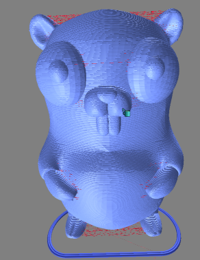

# gcode-viewer

[on npmjs.com](https://www.npmjs.com/package/gcode-viewer)

This is a basic GCode viewer lib for js / ts.  
It is specifically built for [GoSlice](https://github.com/aligator/GoSlice) but may also work with GCode from other slicers.
In contrast to other GCode viewers this one renders the lines using a mesh instead of lines. This is done because 
several browser-OS combination do not support line thickness rendering other than '1'.



## Features

* slicing the viewed lines either by layer or line by line
* line thickness based on the extrusion amount
* colorize the lines based on line-metadata such as temperature, speed or gcode line
* changeable amount of radial segments per line - less (e.g. 3) is faster and needs less RAM, more (e.g. 8 -> the default) may look better.
* uses orbit controls from three js
* relative movement for xyz and extrusion (not tested yet)

## Contribution
You are welcome to help.  
[Just look for open issues](https://github.com/aligator/gcode-viewer/issues) and pick one, create new issues or create new pull requests.

## Usage
### Examples
[Take a look at this example.](example/index.html)  
[Also take a look here.](https://github.com/aligator/dev/blob/main/src/windows/gCodeViewer.tsx)

### Setup

```js
import { GCodeRenderer, Color, SpeedColorizer } from "gcode-viewer"

const renderer = new GCodeRenderer(gcodeString, 800, 600, new Color(0x808080))

// This is an example using the Speed colorizer.
// Other options are:
// * SimpleColorizer (default) - sets all lines to the same color
// * SpeedColorizer - colorizes based on the speed / feed rate
// * TempColorizer - colorizes based on the temperature
// * LineColorizer - colorizes based on the gcodeLine
renderer.colorizer = new SpeedColorizer(this.renderer.getMinMaxValues().minSpeed || 0, this.renderer.getMinMaxValues().maxSpeed)

document.getElementById("gcode-viewer").append(renderer.element())

renderer.render().then(() => console.log("rendering finished"))
```

### Resize
Just call `renderer.resize(width, height)` whenever the size changes.

### Slice the rendered model
To only show specific parts of the model you can use this:
* `renderer.sliceLayer(minLayer, maxLayer)` to slice based on the layer
* `renderer.slice(minPointNr, maxPointNr)` to slice based on the amount of points

For both see the documentation in the code/comments.

### Line resolution
To save some Memory and speedup the rendering a bit, you can reduce
the amount of planes per segment used:

```js
renderer.radialSegments = 3
```
The default is `8`.

### Travel lines
You can change the line width of travel lines:
```js
renderer. travelWidth = 0.1
```
The default is `0.01`. `0` is also possible to completely hide them.

### Access three.js
Both, the scene and the whole three.js is exported, so you can use it.  
For example you can customize the scene setup:

```js
renderer.setupScene = () => {
    // Set up some lights. (use different lights in this example)
    const ambientLight = new gcodeViewer.THREE.AmbientLight(0xff0000, 0.5);
    renderer.scene.add(ambientLight);

    const spotLight = new gcodeViewer.THREE.SpotLight(0x00ff00, 0.9);
    spotLight.position.set(200, 400, 300);
    spotLight.lookAt(new gcodeViewer.THREE.Vector3(0, 0, 0))

    const spotLight2 = new gcodeViewer.THREE.SpotLight(0x0000ff, 0.9);
    spotLight2.position.set(-200, -400, -300);
    spotLight2.lookAt(new gcodeViewer.THREE.Vector3(0, 0, 0))
    renderer.scene.add(spotLight);
    renderer.scene.add(spotLight2);

    renderer.fitCamera()
}
renderer.render().then(() => console.log("rendering finished"))
```
